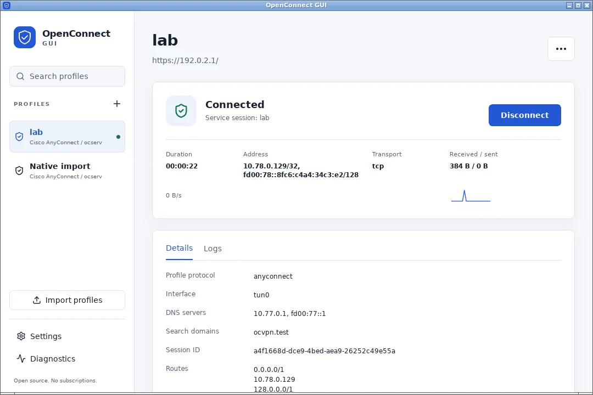
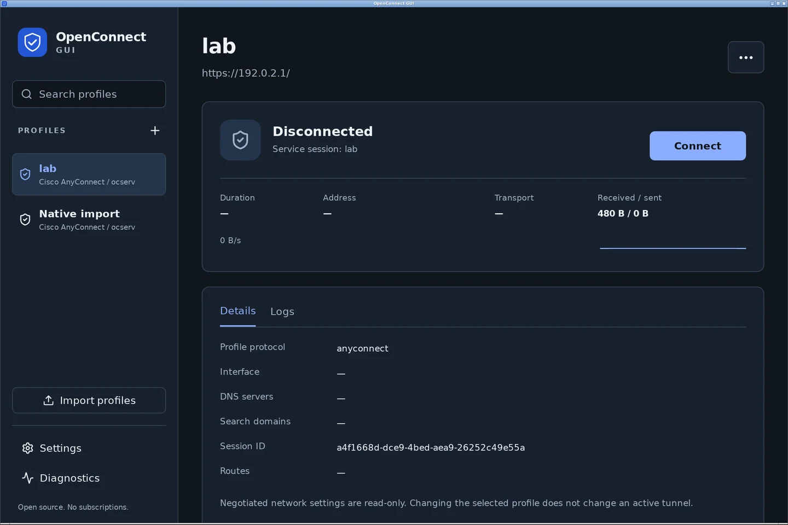

# OpenConnect GUI

### Your VPN. Your choice of interface.

A native desktop, a full-screen terminal UI, and a scriptable CLI—built around one shared OpenConnect engine. Connect in one interface, check the same session in another, and close the window without dropping your VPN.

**Open source · No application account · No activation server · No subscriptions**



*Actual Linux desktop connected to the isolated ocserv test VPN. Connection state, addresses, routes, DNS, and traffic come from the running service—not a simulated dashboard.*

[Get started](#get-started) · [User guide](native/USAGE.md) · [Build and packaging](packaging/README.md) · [Verification](native/VERIFICATION.md)

## A desktop when you want one. A terminal when you don't.

### See your connection clearly

Manage profiles, complete authentication, and inspect the connection in a native desktop application. Light, dark, and system themes, keyboard navigation, native file dialogs, and HiDPI rendering keep everyday tasks straightforward.

The connection view shows the negotiated interface, IPv4/IPv6 addresses, transport, DNS, routes, session duration, and observed traffic. Errors remain actionable; an unavailable service is never presented as a healthy connection.

### Keep working after the window closes

A privileged service owns the tunnel. The desktop and terminal interfaces run as your ordinary user.

Closing the GUI or pressing `q` in the TUI leaves an established VPN running. Use **Disconnect**, **Disconnect and quit**, or `ocvpn disconnect` when you want it stopped. A native first-close message explains the difference; tray support depends on your desktop environment.

### Use the same profiles everywhere

Create or edit a profile in the GUI, CLI, or TUI. The other interfaces see the same metadata. Revision checks prevent stale edits from silently replacing newer changes.

Import and export profiles with native dialogs or CLI commands. Saved credentials are kept separate from exported metadata.



*Actual native dark-mode rendering at 2× display scale.*

## Built for real authentication

- Server-driven forms, authentication groups, gateway selection, and multi-round MFA.
- Primary and secondary client certificate/key references, certificate decisions, and supported token modes.
- GlobalProtect portal and gateway authentication, including independent rounds.
- Embedded, system, and manual browser workflows with attempt-bound callback handling.
- Opt-in operating-system credential storage; no plaintext credential fallback.
- Noninteractive operation that fails explicitly when credentials or interaction are required.

**Trust is not silently relaxed.** Embedded SSO rejects explicit TLS pin policies that native webviews cannot enforce before credential-bearing requests. System/manual alternatives are explicit choices. See the [authentication and trust guide](native/USAGE.md#authentication-and-trust).

## One engine, seven protocol families

| Protocol | Profile ID |
|---|---|
| Cisco AnyConnect / ocserv | `anyconnect` |
| Juniper Network Connect | `nc` |
| Ivanti / Pulse Connect Secure | `pulse` |
| Palo Alto GlobalProtect | `gp` |
| F5 BIG-IP | `f5` |
| Fortinet FortiGate | `fortinet` |
| Array Networks | `array` |

These are the protocols exposed by the bundled OpenConnect 9.21 engine—not a claim that every appliance, authentication policy, or proprietary posture requirement has been validated. [Read the tested coverage and limitations.](native/VERIFICATION.md)

## Get started

**Current status: source preview.** Native package recipes are included; this repository does not yet provide a validated, multi-platform binary release. Follow the [build and installation guide](packaging/README.md) for the desktop or CLI/TUI flavor.

After installing your build:

```sh
# Check the actual engine and service
ocvpn doctor

# Create a profile; HTTPS paths and non-default ports are preserved
ocvpn profile add --name work \
  --server https://vpn.example.com --protocol anyconnect

# Choose your interface
ocvpn gui
ocvpn tui
ocvpn connect work
```

No passwords belong in command arguments. Interactive authentication prompts you when needed; automation can use private stdin input.

### A CLI that fits your workflow

```sh
ocvpn status
ocvpn --json status
ocvpn status --watch
ocvpn logs --follow
ocvpn connect work --foreground
ocvpn disconnect
```

JSON output has a versioned envelope and stable error codes. Foreground connections disconnect and wait for cleanup on Ctrl-C. Shell completions are available through `ocvpn completions`.

### A full-screen TUI—not a shell wrapper

Run `ocvpn tui` for profile editing, authentication, live connection details, searchable logs, import/export, and settings.

| Key | Action |
|---|---|
| `c` / `d` | Connect / disconnect |
| `n` / `e` | Add / edit a profile |
| `a` | Profile actions |
| `l` / `/` | Logs / filter the focused view |
| `s` / `?` | Settings / keyboard help |
| Ctrl+S / Escape | Submit / cancel a form |
| `q` / `Q` | Leave the VPN running / disconnect and quit |

Unicode, masked password fields, bracketed paste, narrow terminals, and `NO_COLOR` are supported. [Complete usage and automation reference →](native/USAGE.md)

## Platform and verification status

| Platform | Current evidence |
|---|---|
| Linux x86_64 | Actual desktop and TUI operation; native protocol/browser fixtures; real dual-stack ocserv traffic, DNS, routing, and crash recovery. Ubuntu 22.04 baseline Debian/source installation and Fedora 42 CLI RPM installation exercised. |
| macOS Intel / Apple Silicon | Native implementation and packaging routes included. Native execution and OS approval flows are not yet verified. |
| Windows x86_64 | Native implementation and packaging routes included. GNU cross-checks are not a substitute for native Windows/MSVC, service, Wintun, or desktop acceptance. |

Linux release builds target the Ubuntu 22.04 / GLIBC 2.35 baseline. The implementation includes transactional networking and recovery, but successful local fixtures are not vendor-appliance certification. All authorized vendor/OS interoperability rows remain explicitly unverified until backed by actual observations.

See [verification evidence and boundaries](native/VERIFICATION.md) and [release workflow requirements](packaging/README.md#release-workflow-and-acceptance-boundaries).

## Build, inspect, contribute

The repository includes the Rust workspace, Tauri/React desktop, pinned native engine sources and patches, platform installation code, native fixtures, and an isolated VPN lab.

- [Build prerequisites and package formats](packaging/README.md)
- [Profiles, settings, authentication, CLI and TUI reference](native/USAGE.md)
- [Native verification commands and vendor matrix](native/VERIFICATION.md)
- [Changelog](CHANGELOG.md)

Build and lab outputs can consume substantial disk space. Run verification on a disposable machine with adequate free space, stop owned lab environments when finished, and remove generated `target/` outputs when they are no longer needed. Never use a blanket Docker prune on a shared workstation.

## License

Original application code is **GPL-3.0-only**. OpenConnect and other bundled components retain their own license notices; the combined bridge library, corresponding sources, and installed license inventory are documented in the [packaging guide](packaging/README.md). See [LICENSE](LICENSE).
